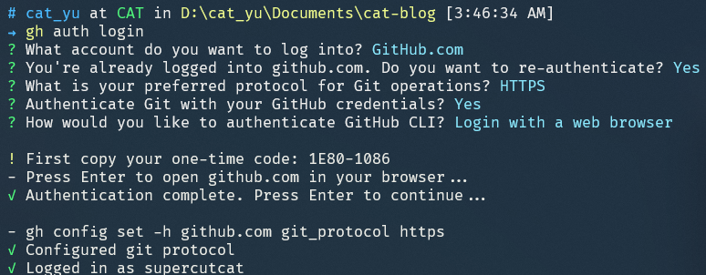
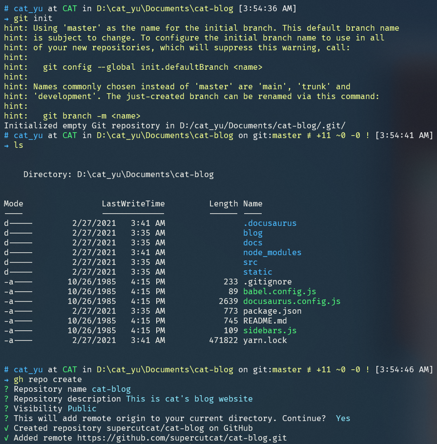

## Docusaurus创建

[Docusaurus 中文网](https://www.docusaurus.cn/docs/installation)

### 安装方式

---

1.直接通过@docusaurus/init安装

 `npx @docusaurus/init@latest init [name] [template]`

2.使用yarn全局安装@docusaurus/init再运行该脚手架

`yarn global add @docusaurus/init`

`docusaurus-init init`

### 项目结构

---

* /blog/ - 包含博客的 Markdown 文件。
* /docs/ - 包含文档的 Markdown 文件。可在 sidebars.js 中自定义文档侧边栏的顺序。
* /src/ - 非文档文件，例如页面或自定义的 React 组件。
* /src/pages - 此目录中的所有文件都将转换为网站页面(page)。
* /static/ - 静态文件目录。此处的所有内容都将复制到最终的 build 目录下。
* /docusaurus.config.js - 包含站点配置的配置文件。
* /package.json - Docusaurus 网站也是一个 React 应用程序。你可以在其中安装和使用所需的任何 npm 软件包。
* /sidebar.js - 生成文档时使用此文件来指定侧边栏中的文档顺序。

## 部署到github

1. gh创建仓库

[GitHub CLI官网](https://cli.github.com/manual/)

* 初次使用gh的时候需要登录github

通过`gh auth login`命令，后续会依次提示操作。

* 其次使用`git init`初始化
* 最后使用`gh repo create`创建仓库

3. git上传项目
	1. git add . (添加当前项目文件)
	2. git commit -m "描述"  (添加修改文件的描述)
	3. git push 上传文件
