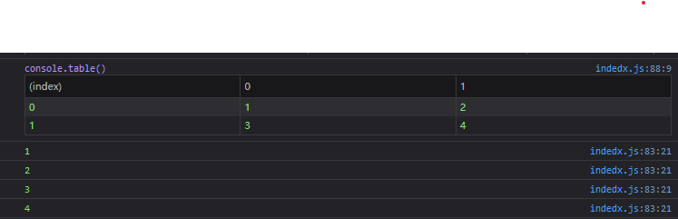

[TOC]
# 数组 array

**数组**最简单的内存数据结构

数组存储一系列同一种数据类型的值，即使JavaScript可以保存不同类型的值，但遵守最佳实践。

## 创建和初始化数组

使用new创建数组

```javascript
new Array();

new Array(7);

new Array(1, 2, 3);
```

直接使用[]中括号创建数组

```javascript
let arr = [];
let arr = [1, 2, 3, 4];
```

可以使用数组的length属性判断数组的大小

``` javascript
arr.length;
```


## 访问元素和迭代数组

``` javascript
for (let i = 0; i < arr.length; i++) {
    console.log(arr[i]);
}
```


### Fibonacci sequence数组求和

Fibonacci前两项是1，第三项开始都等于前两项之和

``` javascript
const fibonacci = [];
fibonacci[1] = 1;	// fibonacci数列不存在0, 所以从直接略过
fibonacci[2] = 1;

for (let i = 3; i < 20; i++) {
    fibonacci[i] = fibonacci[i - 1] + fibonacci[i - 2];
}

for (let i = 1; i < fibonacci.length; i++) {
    console.log(fibonacci[i]);
}


```


[^Fibonacci sequence]:斐波那契数组


## 添加元素

### 在数组末尾插入

赋值给数组中最后一个空位上的元素

``` javascript
arr[arr.length] = "new element";
```

JavaScript是一个可修改的对象。如果添加元素，他就会动态增长。在其他语言里，会决定数组的大小。要添加元素就要创建一个全新的数组，不能简单的添加元素。


push方法

``` javascript
arr.push(1);
arr.push(1, 2);
```

### 在数组开头插入

```` javascript
Array.prototype.insertFirstPosition =function (value)  {
  for (let i = this.length; i > 0; i--) {
    this[i] = this[i - 1];
    }
    this[0] = value;
};
arr.insertFirstPosition(-1)
````


unshift方法

``` javascript
arr.unshift(-1);
arr.unshift(-2, -1);
```


## 删除元素

### 从数组末尾删除元素

pop方法

``` javascript
arr.pop();
```

通过push和pop方法，就能用数组来模拟栈。

### 从数组开头删除

``` javascript
for ( let i = 0; i < arr.length; i++) {
    arr[i] = arr[i + 1];
}
```

在C#，java等中可能会抛出异常， 引用了一个数组还未初始化的值

只是将数组的第一位用第二位覆盖了，并没有删除元素(数组长度仍然是一样的，并且多了一个未定义元素)

``` javascript
const arr = [1, 2, 3, 10];

Array.prototype.reIndex = function (myArray) {
  const newArray = [];
  for (let i = 0; i < myArray.length; i++) {
    if (myArray[i] !== undefined) {
      newArray.push(myArray[i]);
    }
  }
  return newArray;
};

Array.prototype.removeFirstPosition = function () {
  for (let i = 0; i < this.length; i++) {
    this[i] = this[i + 1];
  }
  return this.reIndex(this);
};

const arrCopy = arr.removeFirstPosition();
console.log(arrCopy);
```

使用shift方法

``` javascript
arr.shift()
```

通过shift和unshift方法，可用数组模拟基本的队列数据结构

## 在任意位置添加或删除元素

splice()方法

``` javascript
splice(index, deleteNumber, ...addElement)
arr.splice(5, 3)	// 删除从5往后的三个元素
arr.splice(5, 0, 2, 3, 5)	// 从5往后添加 2 3 5三个元素
arr.splice(5, 3, 2, 3, 5)	// 从5往后删除三个元素再添加2 3 5三个元素
```


##  二维数组和多维数组

JavaScript中只支持一维数组，但是可以通过数组中嵌套数组实现任一多维数组。

``` javascript
arr[0] = [];
arr[0][0] = 1;
arr[0][1] = 2;

arr[1] = [];
arr[1][0] = 3;
arr[1][1] = 4;
```

|       | 0    | 1    |
| ----- | ---- | ---- |
| **0** | 1    | 2    |
| **1** | 3    | 4    |


### 迭代二维数组

``` javascript
const arr = [];
arr[0] = [];
arr[0][0] = 1;
arr[0][1] = 2;

arr[1] = [];
arr[1][0] = 3;
arr[1][1] = 4;

function printMatrix(myMatrix) {
    for (let i = 0; i < arr.length; i++) {
        for (let j = 0; j < arr[i].length; j++) {
            console.log(myMatrix[i][j]);
        }
    }
}

printMatrix(arr);
console.table(arr)	// 可以在控制台打印二维数组
```



### 多维数组

3 × 3 × 3矩阵

创建

``` javascript
const matrix3x3x3 = [];
for (let i = 0; i < 3; i++) {
  matrix3x3x3[i] = [];
  for (let j = 0; j < 3; j++) {
    matrix3x3x3[i][j] = [];
    for (let z = 0; z < 3; z++) {
      matrix3x3x3[i][j][z] = i + j + z;
    }
  }
}
```

遍历

``` javascript

for (let i = 0; i < matrix3x3x3.length; i++) {
  for (let j = 0; j < matrix3x3x3[i].length; j++) {
    for (let z = 0; z < matrix3x3x3[i][j].length; z++) {
      console.log(matrix3x3x3[i][j][z]);
    }
  }
}

0
1
2
1
2
3
2
3
4
1
2
3
2
3
4
3
4
5
2
3
4
3
4
5
4
5
6
```


## JS数组方法

| function | description                                     |
| -------- | ----------------------------------------------- |
| concat   | Connect multiple arrays.                         |
| every    |	Run a given function on each element in the array, each element returns true, and true is returned. |
| filter   |	Run a given function on each element in the array, returns an array of elements of true.            |
| forEach | Run a given function on each element in the array,  this method doesn't return a value. |
| 	join	|	Connect all the array elements into a single string.	|
| 	indexOf	|	Returns the index of the first array element equal to a given parameter. |
| lastIndexOf |	Returns the maximum value in the index of the first array element equal to a given parameter. |
|	map |	Run a given function on each element in the array, returns an array of results from each function call. |
| reverse | The order in which the group elements are reversed. |
|	slice | 	Incoming index values, returning elements within the corresponding index range in the array as new arrays. |
| some | Run a given function on each element in the array,  any element returns true, and true is returned. |
| sort | Sort arrays alphabetically, supporting incoming functions that specify the sort method as arguments |
| toString | Returns the array as a string |
| valueOf  | Similar to toString, returns the array as a string |


### 数组合并

在以下场景：有多个数组，需要合并成一个数组。
解决方法： 1.  迭代各个数组，然后将元素加入到最终的数组。
2. concat方法。

``` javascript 
  const zero = 0;
  const positiveNumbers = [1, 2, 3];
  const negativeNumbers = [-3, -2, -1];
  let numbers = negativeNumbers.concat(zero, positiveNumbers)
    	
```

concat方法可以向一个数组传递数组、对象或是元素，
数组会按照该方法传入的参数顺序连接指定数组。


### 迭代器函数
假设数组中的值是1到15;如果元素里的元素可以被2整除(偶数)，函数就返回true，否则返回false。
``` javascript
  // ES5函数声明
  function isEven(x) {
    return x % 2 === 0 ? true : false;
    // 可以简写为
    return (x % 2 === 0)
  }
  let numbers = [1, 2, 3, 4, 5,  6, 7, 8, 9, 10, 11, 12, 13, 14, 15];
  
  
  // ES6箭头函数写法
  const isEven = x => x % 2 === 0;
  
```

1. every

every方法会迭代数组中的每一个元素，直到函数返回false。
``` javascript
numbers.every(isEven);
```
在这个例子中 numbers第一个元素是1，他不是2的倍数，函数会返回false，然后every执行结束。
2. some

和every方法相反，some会迭代数组中的每一个元素，直到函数返回true
``` javascript
numbers.some(isEven);
```
在本例中,第二个元素2是偶数，第一个元素1是奇数。所以遍历第一个元素是false，第二个元素true，并在此会结束迭代，并返回true。
3. forEach

迭代整个数组，无返回值。
``` javascript
numbers.forEach(x => console.log(x % 2 === 0));
```

4. map & filter

返回新数组的迭代方法
``` javascript
  const myMap = numbers.map(isEven);
  // myMap的值：[false, true, false, true ...]
  
  // filter方法，返回的新数组由使函数返回true的元素组成
  const evenNumbers = numbers.filter(isEven);
  // evenNumbers的值：[2, 4, 5, 8, 10, 12 ,14]
```

5. reduce

reduce方法，接受四个参数：previousValue, currentValue,index,array
(其中index和array参数可选)。这个函数会返回一个将叠加到累加器的值，reduce停止执行后会返回这个累加器。对一个数组求和：
``` javascript
  const sum = numbers.reduce((previous, current) => previous + current);
  // sum is 120
```

**这三个方法(map, filter ,reduce)是JavaScript函数式编程的基础**

### ECMAScript 6

|function|description|
|-|-|
|@@iterator |Returns an iterator object containing the key-value pairs of the array, and the key-value of the array can be obtained throngh synchronous calls.|
|copyWithin|Copy a series of elements to the specified starting position of the array.|
|entries|Return @@iterator containing all key-value pairs of the array.|
|includes|Returns true if there is an element in the array,otherwise returns false.|
|find|Find an element from the array according to the conditions given by the callback function, and return the element if found.|
|findIndex|Find an element from the array according to the conditions given by the callback function, and return the index of the element if found.|
|fill|Fill the array with static values.|
|from|Create a new array based on an existing array.|
|keys|Return @@iterator containing all indexes of the array.|
|of|Create a new array based on the parameters passed in.|
|values|Return @@iterator containing all the values in the array.|

1. for..of

	for...of与for...in：
    区别在于diedaifangs。for..in语句可以任意顺序迭代对象的可枚举属性。for..of语句遍历可迭代对象定义要迭代的数据。
	``` javascript
      for (const n of numbers) {
        console.log(n % 2 === 0 ? 'even' : 'add')
      }
    ```
2. @@iterator

ES2015为Array类增加了一个@@iterator属性，需要通过Symbol.iterator来访问。
``` javascript
  const num = [1,2,3,4,5,6,7,8,9];
  let iterator = num[Symbol.iterator]();
  console.log(iterator.next().value);  // 1
  console.log(iterator.next().value);  // 2
  console.log(iterator.next().value); // 3
```
不断调用迭代器的next方法，就能依次得到数组中的值。

可以直接数组通过下面代码输出
``` javascript
  for (const n of iterator) {
    console.log(n);
  }
```
数组中的值都迭代完之后，iterator.next().value会返回undefined。

3. entries, keys & values

三种从数组中得到迭代器的方法。

entries方法返回包含键值对的@@iterator。
``` javascript
  let aEntries = numbers.entries();	//得到键值对的迭代器
  console.log(aEntries.next().value);	// [0, 1] - 位置0的值为1
  console.log(aEntries.next().value);	// [1, 2] - 位置1的值为2
  console.log(aEntries.next().value);	// [2, 3] - 位置2的值为3

  // 也可以使用下面代码
  aEntries = numbers.entries();
  for(const n of aEntries) {
    console.log(n);
  }
```
使用集合、字典、散列表等数据结构时，能够取出键值对会很有用。

keys方法返回数组索引的@@iterator。
``` javascript
  const aKeys = numbers.keys();
  console.log(aKeys.next());	// {value: 0, done: false}
  console.log(aKeys.next());	// {value: 1, done: false}
  console.log(aKeys.next());	// {value: 2, done: false}
```
keys方法会返回numbers数组的索引。一旦没有可迭代的值，aKeys.next()就会返回一个value属性undefined、done属性为true的对象。如果done属性的值为false，就意味着还有可迭代的值。

values方法返回的@@iterator则包含数组的值。
``` javascript
  const aValues = numbers.values();
  console.log(aValues.next());	// {value: 1, done: false}
  console.log(aValues.next());	// {value: 2, done: false}
  console.log(aValues.next());	// {value: 3, done: false}
```

4. from

Array.from方法根据已有的数组创建一个新数组。比如复制numbers数组。
``` javascript
  let numbers = Array.from(numbers);
  
  // 还可以传入一个用来过滤值的函数。
  let evens = Array.from(numbers, x => (x % 2 == 0));
  // 该方法会创建一个evnes数组，以及值true或false。
```
5. Array.of

``` javascript
  // Array.of方法根据传入的参数创建一个新数组。
  let num1 = Array(1);
  let num2 = Array(1, 2, 3, 4, 5, 6);
  
  // 等同于
  let num1 = [1];
  let num2 = [1, 2, 3, 4, 5, 6,];
  
  // 也可以复制已有数组 
  let numbersCopy = Array.of(...num2);
  
 // 等同于Array.from(num4)。区别在于使用了展开运算符(...),会把num2数组里的值都展开成参数。
```
6. fill

fill方法用静态值填充数组
``` javascript
  let numbersCopy = Array.of(1, 2, 3, 4, 5, 6);
```
numbersCopy数组length是6，也就是有6个位置。
``` javascript
  numbersCopy.fill(0);	// [0, 0, 0, 0, 0, 0]
```
numbersCopy数组所有位置上的值都会变成0。
还可以指定开始填充索引。

``` javascript
  numbersCopy.fill(2, 1)	// [0, 2, 2, 2, 2, 2]
```
数组从1开始的所有位置都是2

``` javascript
  numbersCopy.fill(1, 2, 5);	// [0, 2, 1, 1, 1, 2]
```
数组会把1填充到数组索引2到5的位置(不包括5)

适合用于创建数组并初始化值的时候
``` javascript
  let ones = Array(6).fill(1);	// [1, 1, 1, 1, 1, 1]
```

7. copyWithin

copyWith方法复制数组中的一系列元素到同一数组指定的起始位置。
``` javascript
  let numbersCopy = Array.of(1, 2, 3, 4, 5, 6);
```

``` javascript
  copyArray.copyWithin(0,3)	// [4, 5, 6, 4, 5, 6]
```

``` javascript
  copyArray.copyWithin(1, 3, 5)	// [1, 4, 5, 4, 5, 6]
```

### 排序元素

1. 自定义排序
2. 字符串排序

### 搜索

1. ECMAScript 2015 – find & findIndex
2. ECMAScript 7 – includes

### 输出数组为字符串

## 类型数组
|类型数组|数据类型|
|-|-|
|Int8Array|8位二进制补码整数|
|Uint8Array|8位无符号整数|
|Uint8ClampedArray|8位无符号整数|
|Int16Array|16位二进制补码整数|
|Uint16Array|16位无符号整数|
|Int32Array|32位二进制补码整数|
|Uint32Array|32位无符号整数|
|Float32Array|32位IEEE浮点数|
|Float64Array|64位IEEE浮点数|

``` javascript
  let length = 5;
  let int16 = new Int16Array(length);
  
  let array16 = [];
  array16.length = length;
  
  for (let i = 0; i < length; i++) {
    int16[i] = i + 1;
  }
  console.log(int16);
```


## TypeScript中的数组
